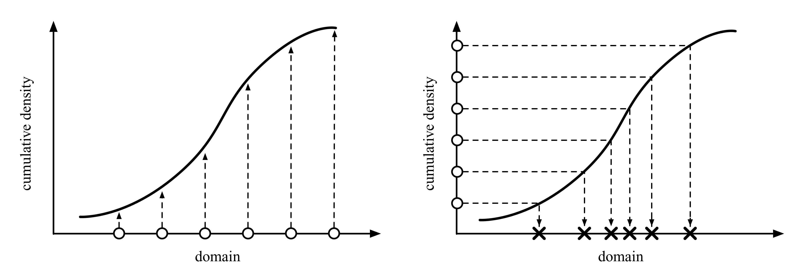

P# Algorithm

Update process of `Sketch` of *Flip* internally divides into two types: `narrowUpdate` and `deepUpdate`. `narrowUpdate` changes count only, not bin, while `deepUpdate` changes both bin and count. Then, when a user updates data using `Sketch`, most of the time `narrowUpdate` is called, but `deepUpdate` is called to rearrange bin periodically, every 100 times by default.

The algorithm of `narrowUpdate` is intuitive. The algorithm of `deepUpdate` matters. Here I propose an algorithm that equally divides the domain of the inverse cumulative density function, also called the quantile function, and then uses the range as a new quantization point. This algorithm is not actually an optimal value for KL-divergence. However, this method is very simple, easy to understand, and requires only a small amount of computation. And above all, it yields a sufficiently small KL-divergence.

## Cumulative-equal split algorithm for  `deepUpdate`

The following figure shows the difference between conventional and `Sketch`'s method to determine quantization points. (left) The conventional method simply divides the domain equally. (right) `Sketch` method finds points on domain that equally divides the cumulative density.

For those who study image processing, this algorithm can be compared to the [Histogram Equalization](https://en.wikipedia.org/wiki/Histogram_equalization) algorithm.

